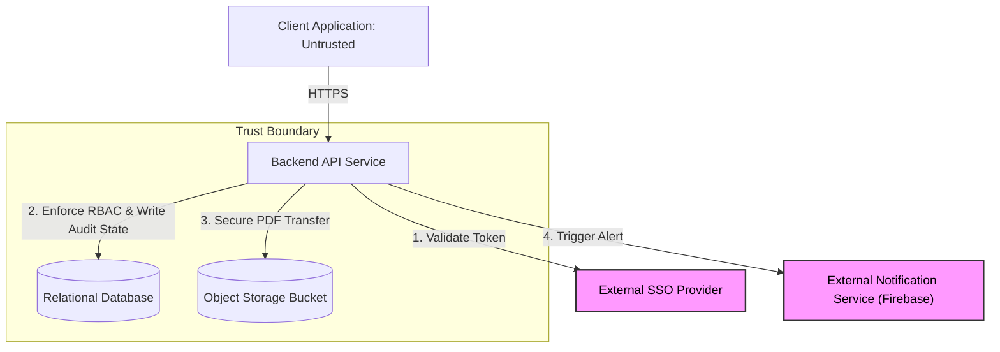

---

# architecture.md: Internal Operations Service Hub

## 1. PURPOSE + SCOPE

**Requirements Driving the Design:**
The architecture must securely manage state transitions for HR requests (from Submission to Fulfillment) and strictly isolate private document payloads to prevent unauthorized access. The design must also enforce an immutable audit log for every action.

**Actors:**

* **Employee:** Initiates requests, polls for status updates, and downloads fulfilled documents.
* **HR Administrator:** Claims requests, updates state transitions, and uploads final document payloads.

**System Boundary:**
The system strictly encompasses the backend logic, request queue, state management, and document storage. It explicitly excludes identity verification (which is delegated to an external provider) and IT ticketing logic.

## 2. STRUCTURE + FLOW

**Components & Responsibilities:**

* **Client Application (Mobile/Web):** Untrusted interface. Responsible solely for displaying the UI and holding the authentication token.
* **Backend API Service:** The core logic engine. Responsible for validating tokens, enforcing role-based access control (RBAC), applying rate limits, and executing state transition rules.
* **Relational Database:** The state machine. Responsible for persistently storing request metadata, current statuses, and the immutable audit log.
* **Object Storage (Cloud Bucket):** The secure warehouse. Responsible for storing heavy PDF document payloads separate from the database.

**External Dependencies:**

* **Company Identity Provider (SSO):** The sole external system, responsible for authenticating users and issuing valid identity tokens.
* **External Notification Service (Firebase):** Responsible for delivering push notifications to users when their request state changes, ensuring they are alerted even when the app is closed.
**Important Data Flows:**

## 3. TRUST + RESILIENCE

**Trust & Authorization Boundaries:**
The strict trust boundary lies at the Backend API Service. The Client Application and the public internet are completely untrusted. The Relational Database and Object Storage are strictly isolated behind the API. No direct communication is allowed between the Client and the database or storage bucket; every interaction must cross the API boundary and pass an RBAC token check.

**Failure Scenarios:**

* **External SSO Outage:** If the Identity Provider goes offline, the API cannot validate tokens. The API is designed to block all traffic and gracefully return a `503 Service Unavailable` error to the Client rather than failing "open" or crashing the server.
* **Database Connection Drop:** If the Relational Database goes completely offline, the API will instantly return a `503 Service Unavailable` message, preventing the user's screen from infinitely loading.
* **Network Interruption During Upload:** If an HR admin's connection drops while uploading a large file, the API will abort the operation, delete any partial data in the Object Storage, and intentionally *not* update the database state to "Completed" to prevent ghost records.
* **Firebase Outage:** If Firebase goes down, the API logs the notification failure but still successfully completes the database state update. Core HR workflows are never blocked by a failed push notification.

**Realistic Scalability & Reliability Notes:**
To protect the Relational Database from automated spam or traffic spikes, the API enforces a strict rate limit (maximum 5 requests per minute, per token).

## 4. DECISIONS

**Communication Decisions:**
The system will use synchronous HTTP communication (REST principles) for all interactions between the Client Application and the Backend API Service. This provides immediate success/failure feedback (e.g., `200 OK` or `400 Bad Request`) to the Actors without needing complex message brokers.

**Major Decisions:**

* **Decision 1: Segregating Data Storage.** We decided to store PDF payloads in a dedicated Object Storage bucket rather than embedding them directly inside the Relational Database.
* *Consequence:* This prevents database bloat, keeps database queries fast, and allows file storage to scale independently.

* **Decision 2: Deliberate Omission of Microservices.** We explicitly decided against adding caching layers (Redis) or message queues (RabbitMQ).
* *Consequence:* For an internal operations tool with predictable traffic, these tools add unnecessary architectural complexity and maintenance costs. The current monolithic API structure handles the load securely and efficiently.

1. What are the major parts and why does each exist?
The backend API service: Exists to be the sole bouncer and logic engine. It enforces all the rules.

The Relational Database: Exists to reliably track the state machine (Pending -> Completed) and store the immutable audit log.

The Object Storage Bucket: Exists to hold heavy PDF files so they don't bloat and slow down the relational database.

2. What is inside vs outside, and which externals are dependencies?
Outside (Untrusted): The Client Application (the employee's phone or browser) and the public internet.

Inside (Trusted): The Backend API, the Relational Database, and the Storage Bucket.

External Dependency: The SSO Provider (Identity). It is an external service we rely on but do not control.

3. How does information move, and where do trust / authorization checks matter?
Information Movement: Information only moves in one direction: from the Client, through the API, and then into Storage/DB.

Where Checks Matter: The authorization check happens exclusively at the API layer. The API acts as the strict Trust Boundary. No data touches the database or the storage bucket until the API verifies the token with the SSO.

4. What happens when a dependency fails, and which spec requirement caused each decision?
When a dependency fails: If the external SSO Provider goes down, our system fails securely. The API instantly returns a 503 Service Unavailable error, blocking everyone rather than accidentally letting unverified users into the HR portal.

Which requirement caused this: The Security & RBAC requirement dictated the strict SSO validation. The Data Isolation constraint caused the decision to use a private Object Storage bucket. The Auditability requirement caused the decision to use database state locks and append-only logs.

---
