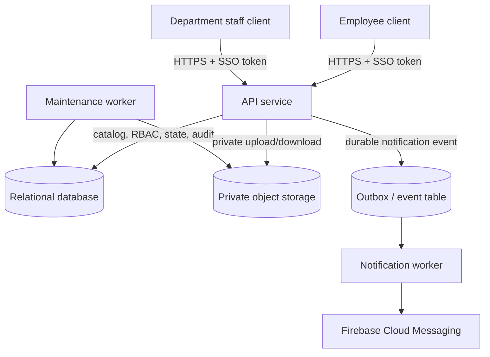

# Architecture: Internal Operations Service Hub

## 1. Scope and principles

The system routes employee requests to accountable departments and protects employee data and documents. The backend is the trust boundary. The client is untrusted and cannot directly access the database, object storage, or notification credentials.

Principles:

* Department ownership is explicit and enforced server-side.
* State transitions are transactional and auditable.
* Notifications are asynchronous to core request writes.
* Storage failures are visible and reconciled, never silently ignored.
* Least privilege applies to employees, department members, administrators, services, and operators.

## 2. Components

* **Web/mobile client:** Catalog, request forms, employee history, department queue, and resolution views.
* **API service:** SSO validation, RBAC, request routing, validation, lifecycle transitions, document brokering, rate limiting, and audit writes.
* **Relational database:** Users, departments, memberships, catalog, requests, documents, and append-only audit logs.
* **Private object storage:** Document payloads with encryption, lifecycle rules, checksums, and no public access.
* **Notification worker:** Sends Firebase notifications from durable events without blocking request transactions.
* **Scheduled maintenance worker:** Purges expired documents, reconciles storage/database state, and reports failures.
* **Observability:** Structured logs, metrics, traces, health checks, and security alerts without sensitive payloads.

## 3. Request flow

1. API validates the credential and loads the user and active memberships. (Academy implementation: email + password with TOTP per ADR-002; SSO token validation stays the production target.)
2. For creation, API validates the request type and derives the owning department.
3. Optional AI intake returns a validated draft only. Optional bounded SLA estimation happens before the database transaction; provider failure uses the documented rule fallback.
4. For a user-approved macro, API revalidates every catalog pairing and atomically writes the parent, children, and audit entries. Submission keys make retries idempotent.
5. API writes ordinary requests and their audit entry transactionally.
6. A durable event triggers notifications after commit.
7. Authorized staff claim and resolve requests through the API. An assigned agent may ask AI for a resolution-note draft; the draft is untrusted, editable, and cannot mutate ticket state.
8. Document transfers are streamed through the API after an authorization check.

## 4. Trust and authorization boundaries

* No client receives database credentials, storage credentials, or unrestricted object URLs.
* Every request endpoint performs resource-level authorization, not just route-level role checks.
* Employees are limited to their own requests.
* Department staff are limited to active departments in their memberships.
* System administrators have cross-department access and their actions are still audited.
* Secrets are stored in a managed secret store and never in source control or logs.

## 5. Resilience and failure handling

* **SSO unavailable:** return `503`; never fail open.
* **Database unavailable:** return `503`; do not report a successful mutation.
* **Storage upload interrupted:** remove partial object, keep request incomplete, and return a clear error.
* **Storage/database mismatch:** mark the document for reconciliation, alert operations, and never expose a guessed or stale download.
* **Notification provider unavailable:** keep the committed request change, retry the notification from the durable event, and alert only after retry policy is exhausted.
* **Worker duplicate delivery:** use idempotency keys and unique event identifiers.
* **Concurrent claim:** conditional update or row lock yields exactly one winner and `409` for the loser.

## 6. Operational controls

* Health endpoint checks API dependencies without exposing internals.
* Metrics cover request volume, queue age, status transitions, failed uploads, notification retries, and purge failures.
* Structured audit/security logs include actor, action, resource, result, correlation ID, and timestamp.
* Backups are encrypted and tested through regular restore exercises.
* Deployments use migrations with rollback guidance and preserve audit history.
* Retention and deletion jobs produce durable success/failure metrics.

## 7. Technology decisions

Use a modular monolith for the initial implementation: one API deployment, one relational database, private object storage, and background workers. Keep domain modules separated internally (identity, catalog, requests, documents, notifications, audit) so independent services can be introduced only when operational evidence justifies them.

Communication between client and API is synchronous REST. Notifications and maintenance are asynchronous because they must not block the core request transaction.

## 8. Implementation notes (post-spec additions)

* **SLA deadlines** are decided per ticket at creation (Groq content analysis
  with static priority fallback) and stored as `slaDueAt`/`slaSource`; see
  `docs/sla-design.md`. The breach center (`GET /requests/breach`) lists
  open overdue tickets with queue-equivalent scoping.
* **AI operations assistance** is optional and non-authoritative: catalog-validated intake, bounded SLA estimates, reviewed parent/child proposals, and assigned-agent resolution drafts. See `docs/week4-production-ai.md`.
* **Healthcheck** (`GET /health`) returns 200 + version/uptime when the
  database pings, **503** when it does not, so orchestrators restart or
  alert on real outages.
* **Edge hardening:** global 100 req/min/IP throttle (10/min on
  `POST /auth/login`), helmet security headers (CSP relaxed for Swagger UI),
  and one-line HTTP access logs without query strings or bodies.
* **API docs** are served live at `/api-docs` (Swagger UI).
